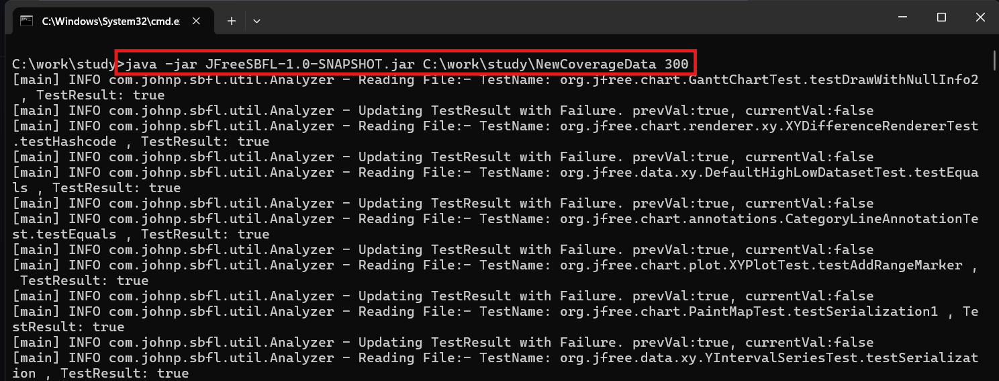
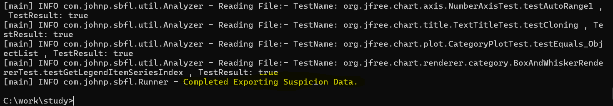
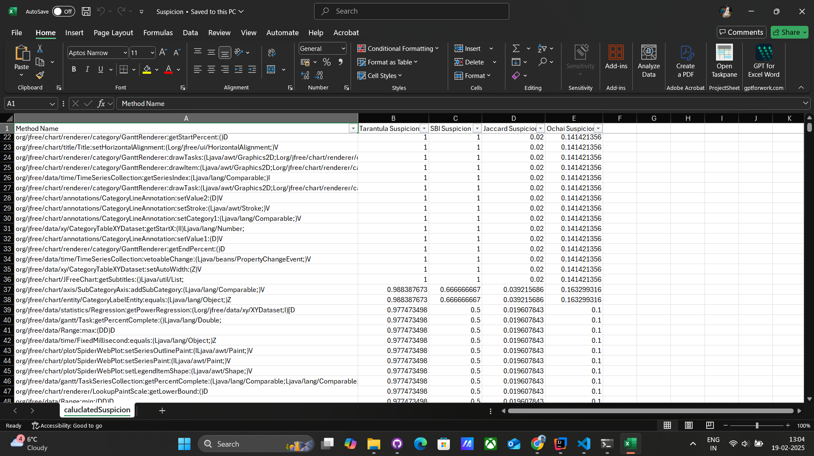

# JFree SBFL(Spectrum Based Fault Localization) Project

## Overview

JFreeSBFL is a Java application that analyzes software testing coverage data and generates an Excel file with the calculated suspicion data. The application takes two runtime arguments: the file path to the coverage data and the fail count. If these arguments are not provided, default values will be used.

## Prerequisites

- Java 8 or higher
- Maven

## Building the Project

To build the project and create an executable JAR file, follow these steps:

1. Clone the repository:
    ```sh
    git clone <repository-url>
    cd JFreeSBFL
    ```

2. Use Maven to build the project and create the JAR file:
    ```sh
    mvn clean package
    ```

The JAR file will be created in the `target` directory.

## Running the Application

To run the application, use the following command:

```sh
java -jar target/JFreeSBFL-1.0-SNAPSHOT.jar <filePath> <failCount>
```




### Arguments

- `<filePath>`: The path to the coverage data directory. If not provided, the default path will be used.
- `<failCount>`: The number of failed tests. If not provided, the default value of 50 will be used.

### Example

If no arguments are provided, the application will use the default values and display a warning message.

### Output

The application will generate an Excel file named `Suspicion.xlsx` in the directory where the JAR file is executed. The Excel file will contain the following columns:

- Method Name
- Tarantula Suspicion
- SBI Suspicion
- Jaccard Suspicion
- Ochai Suspicion

The data will be sorted in descending order based on the Tarantula, SBI, Jaccard and Ochai Suspicion column.



### Logging

The application uses SLF4J with Logback for logging. Log messages will be displayed in the console.
